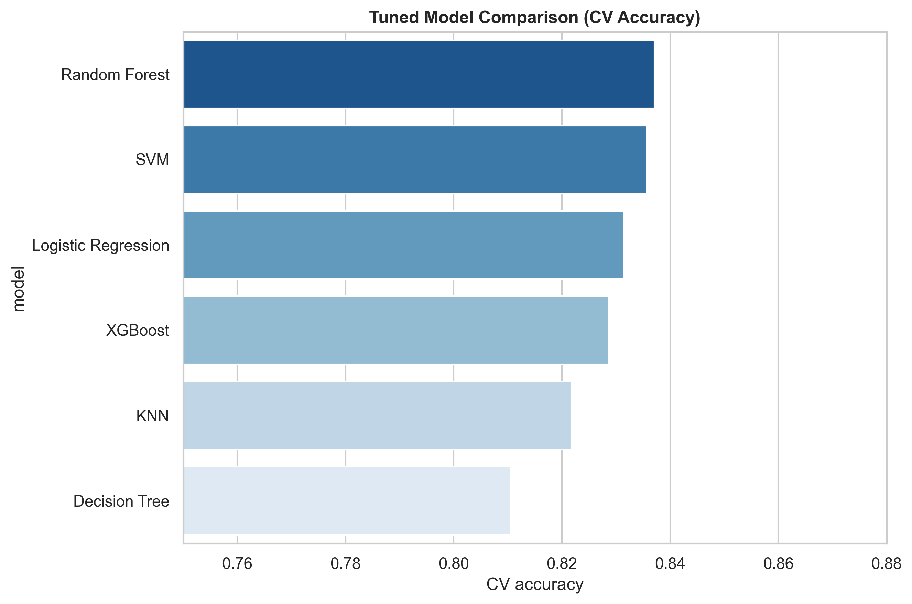
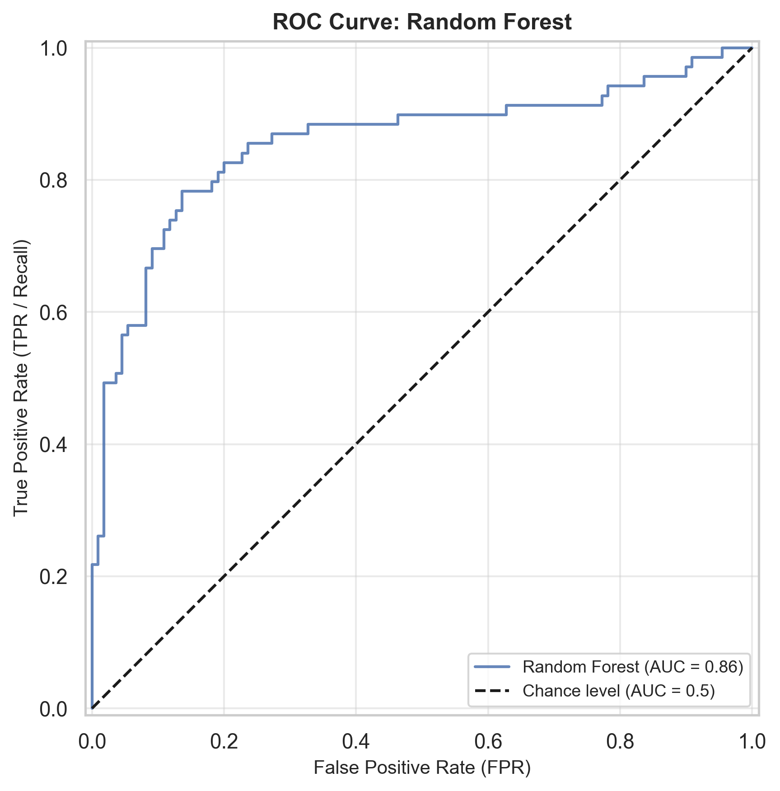
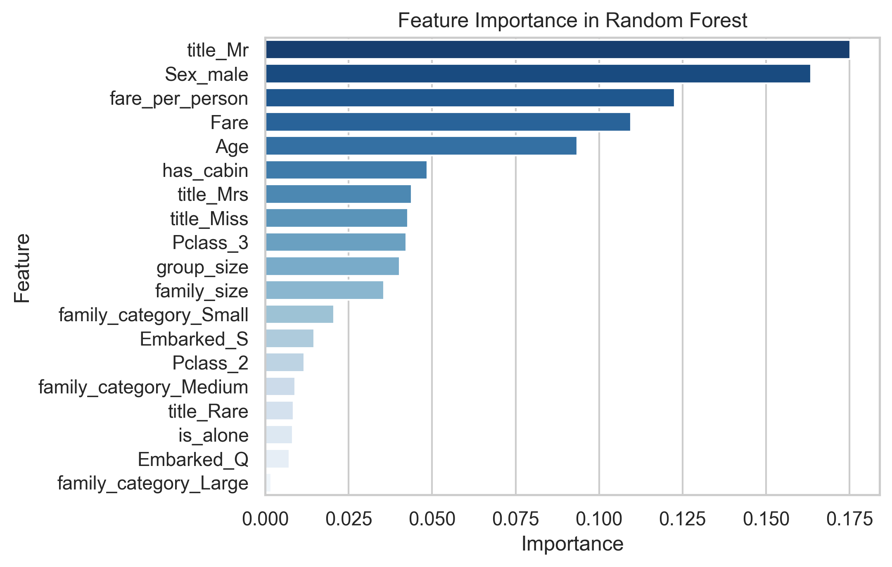
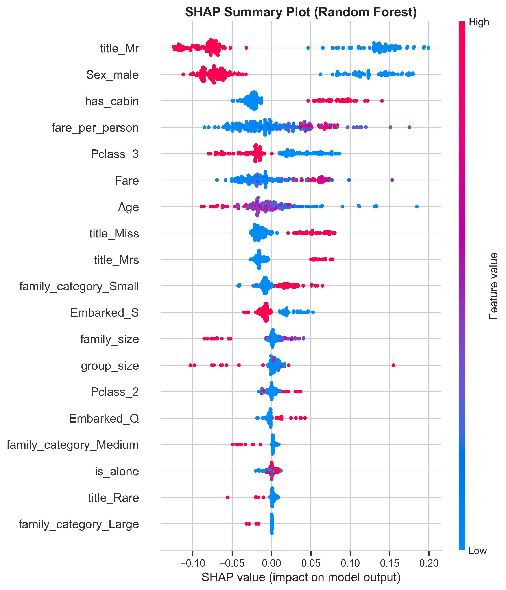

# Titanic Survival Prediction

A machine learning project for predicting passenger survival on the Titanic dataset.

In this project, I explored the dataset, created new features, handled missing values, compared several classification models, tuned their hyperparameters, and used SHAP to better understand the model's predictions.

## Project Overview

The main goal of this project was to build and compare different machine learning models for predicting whether a passenger survived the Titanic disaster.

The workflow includes:

* Exploratory Data Analysis (EDA)
* Feature Engineering
* Leakage-safe preprocessing
* Feature selection using ablation studies
* Model training and comparison
* Hyperparameter tuning with GridSearchCV
* Validation using multiple evaluation metrics
* Model explainability with SHAP

## Dataset

The project uses the classic Titanic dataset.

The training dataset contains **891 passengers** and the test dataset contains **418 passengers**.

The target variable is:

* `0` — Did not survive
* `1` — Survived

Some of the main features include:

* `Pclass`
* `Sex`
* `Age`
* `SibSp`
* `Parch`
* `Fare`
* `Cabin`
* `Embarked`

## Exploratory Data Analysis

I first explored the relationship between passenger characteristics and survival.

Some important observations were:

* Female passengers had a much higher survival rate than male passengers.
* Passenger class was strongly related to survival.
* Survival rates differed across passenger titles.
* Family size showed different survival patterns.
* Missing values were present in several important features.

## Feature Engineering

Several additional features were created to give the models more useful information.

### Passenger Title

Titles were extracted from passenger names and grouped into:

* `Mr`
* `Miss`
* `Mrs`
* `Master`
* `Rare`

### Family Features

I created:

* `family_size`
* `is_alone`
* `family_category`

### Ticket Group Features

Ticket information was used to create:

* `group_size`
* `fare_per_person`

### Cabin Information

A binary `has_cabin` feature was created to indicate whether cabin information was available.

## Data Preprocessing

The preprocessing steps were implemented inside Scikit-Learn pipelines.

A custom `TitanicImputer` transformer was used to calculate imputation statistics from the training data of each cross-validation fold.

This helps prevent information from the validation folds from being used during preprocessing.

Categorical features were encoded using `OneHotEncoder`, while numerical features were scaled for models that require feature scaling.

## Feature Selection

I used forward and backward ablation studies to investigate how different features affected model performance.

### Forward Ablation

| Feature Set       | Mean CV Accuracy |    Std |
| ----------------- | ---------------: | -----: |
| Baseline          |           0.8301 | 0.0226 |
| + Title           |           0.8329 | 0.0332 |
| + Family Size     |           0.8287 | 0.0315 |
| + Is Alone        |           0.8273 | 0.0295 |
| + Family Category |           0.8301 | 0.0193 |
| + Has Cabin       |       **0.8357** | 0.0184 |

### Backward Ablation

| Removed Feature | Mean CV Accuracy |
| --------------- | ---------------: |
| Age             |           0.8161 |
| Fare            |           0.8301 |
| Sex             |           0.7206 |
| Embarked        |           0.8090 |
| Pclass          |           0.7922 |

The backward ablation results show that removing `Sex` or `Pclass` causes a noticeable decrease in performance.

## Models

I trained and tuned six classification models:

* Logistic Regression
* Decision Tree
* Random Forest
* K-Nearest Neighbors
* Support Vector Machine
* XGBoost

Hyperparameters were optimized using `GridSearchCV` with 5-fold cross-validation.

## Model Comparison

The tuned models were compared using their mean cross-validation accuracy.

| Rank | Model               | CV Accuracy |
| ---: | ------------------- | ----------: |
|    1 | Random Forest       |  **0.8371** |
|    2 | SVM                 |      0.8357 |
|    3 | Logistic Regression |      0.8315 |
|    4 | XGBoost             |      0.8287 |
|    5 | KNN                 |      0.8217 |
|    6 | Decision Tree       |      0.8105 |



The **Random Forest** achieved the highest cross-validation accuracy and was selected as the final model.

## Final Model Evaluation

The selected Random Forest model was then evaluated on the held-out validation set.

| Metric              |      Score |
| ------------------- | ---------: |
| Validation Accuracy | **0.8268** |
| ROC-AUC             | **0.8568** |

### Classification Report

| Class    | Precision | Recall | F1-score |
| -------- | --------: | -----: | -------: |
| Died     |      0.84 |   0.88 |     0.86 |
| Survived |      0.80 |   0.74 |     0.77 |

### Confusion Matrix


### ROC Curve



## Feature Importance

The Random Forest feature importances showed that several transformed features had a strong influence on the model.

The most important features included:

1. `title_Mr`
2. `Sex_male`
3. `fare_per_person`
4. `Fare`
5. `Age`
6. `has_cabin`
7. `title_Mrs`
8. `title_Miss`
9. `Pclass_3`
10. `group_size`



## SHAP Explainability

I also used SHAP to understand how the features contributed to the predictions of the selected model.

The SHAP summary plot shows both the importance of the features and how their values affect the model output.



## Ensemble Experiment

As an additional experiment, I built a soft-voting ensemble using:

* SVM
* Random Forest
* Logistic Regression

The ensemble achieved a validation accuracy of **0.8324**.

Although the ensemble performed slightly better than the individual Random Forest on this particular validation split, the Random Forest remained the selected model because it had the highest cross-validation accuracy among the tuned individual models.

## Results

The final results of the project were:

* Best model based on CV accuracy: **Random Forest**
* Best CV accuracy: **0.8371**
* Validation accuracy: **0.8268**
* Validation ROC-AUC: **0.8568**
* Ensemble validation accuracy: **0.8324**

The difference between cross-validation and validation performance also shows why evaluating the final model on data that was not used during tuning is important.

## Technologies Used

* Python
* NumPy
* Pandas
* Matplotlib
* Seaborn
* Scikit-Learn
* XGBoost
* SHAP

## Project Structure

```text
titanic-survival-prediction/
│
├── titanic_v2.py
├── requirements.txt
├── README.md
│
└── results/
    ├── model_comparison.png
    ├── confusion_matrix.png
    ├── roc_curve.png
    ├── feature_importance.png
    └── shap_summary.png
```

## Key Takeaways

This project gave me practical experience with a complete machine learning workflow, from data exploration and feature engineering to model tuning, evaluation, and explainability.

One of the main findings was the importance of features such as **Sex, Pclass, Age, and passenger title** when predicting survival.

The project also showed that a higher cross-validation score does not necessarily guarantee the same performance on a separate validation set.
